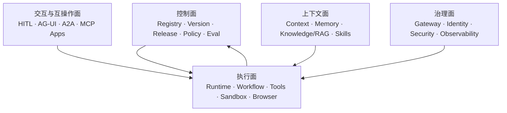

# AI Agent 核心技术开源全景（2026）

> 面向 AI Agent 应用架构师的系统研究地图  
> 版本：2026-08-05  
> 数据入口：[完整项目清单](./data/agent-open-source-projects.csv) · [每周动态榜单](./reports/weekly/latest.md) · [周榜工具说明](./docs/weekly-ranking-tool.md)

## 一、先说结论

如果把 Agent 技术研究理解为“把 LangChain、AutoGen、CrewAI 都跑一遍”，最后得到的通常只是框架 API 对比。真正值得架构师研究的是：一个目标如何在受控上下文中变成可恢复、可授权、可观测、可评测的执行过程。

这套地图把 Agent 系统分成五个平面、18 个模块：

结合你现有的 AI Stack、Golang Runtime、ContextManager、Memory、MCP、Sandbox、HITL 和多环境发布经验，最值得优先研究的不是单一“最强框架”，而是六组对照：

1. **Runtime 内核**：LangGraph、OpenAI Agents SDK、Google ADK、Microsoft Agent Framework。
2. **Context / Memory 分层**：context-mode、OpenViking、Mem0、Letta、Cognee。
3. **Skill / Tool 治理**：Agent Skills 规范、Anthropic Skills、MCP、ToolHive、MCP Context Forge、SkillSpector。
4. **隔离执行**：OpenSandbox、E2B、Daytona、OpenShell、Kubernetes Agent Sandbox。
5. **生产治理闭环**：LiteLLM / TensorZero + OpenFGA / Logto + Langfuse / Phoenix + DeepEval / Promptfoo。
6. **完整 Harness 样本**：Codex、OpenHands、OpenCode、DeerFlow；它们能把以上模块放回一条真实执行链里观察。

## 二、如何判断“热门且值得研究”

本报告没有按 Stars 直接排名。项目进入 P0/P1/P2，综合看五个信号：

| 信号 | 关注点 |
|---|---|
| 架构代表性 | 是否把一个关键问题做成清晰、可复用的技术边界 |
| 生态采用 | 是否有稳定社区、SDK、集成方或事实标准地位 |
| 维护活跃度 | 是否仍有提交、发布、Issue 处理，而不是只有历史 Stars |
| 生产相关性 | 是否覆盖恢复、权限、隔离、审计、成本、评测等生产约束 |
| 你的相关性 | 是否能与你现有控制面/执行面、Runtime、MCP、跨域授权形成对照 |

优先级定义：

- **P0｜必看**：适合做源码级研究和最小原型。
- **P1｜主流补充**：适合横向对比，理解不同设计路线。
- **P2｜专项/观察**：解决特定问题或增长很快，但成熟度、许可证或可持续性需要继续验证。
- **基础设施**：不是 Agent 原生项目，但构成生产 Agent 的关键底座。

## 三、18 个核心模块总图

| # | 模块 | 它真正解决的问题 | 首批研究项目 |
|---:|---|---|---|
| 1 | Agent Runtime / SDK | Agent loop、状态、事件、工具调用、handoff、流式输出 | LangGraph、OpenAI Agents SDK、Google ADK、Microsoft Agent Framework |
| 2 | Durable Execution | 进程崩溃、长任务、重试、定时器、幂等、恢复 | Temporal、Restate、DBOS |
| 3 | Context Manager | token 预算、上下文选择、压缩、污染隔离、工具结果治理 | context-mode、OpenViking、Aider、Continue |
| 4 | Agent Memory | 工作记忆、情景记忆、语义记忆、程序记忆的写入与召回 | Mem0、Letta、Cognee、MemOS、LangMem |
| 5 | Knowledge / RAG | 外部知识摄取、索引、检索、图谱、证据与版本 | LlamaIndex、Haystack、RAGFlow、GraphRAG、LightRAG |
| 6 | Agent Skills | 能力包格式、渐进式披露、脚本/资源、复用和分发 | Agent Skills、Anthropic Skills、Superpowers、Composio |
| 7 | MCP / Tool Infrastructure | 工具协议、server 生命周期、注册、网关、策略和审计 | MCP SDK、Registry、Inspector、ToolHive、Context Forge |
| 8 | Agent Interoperability | Agent-Agent、Agent-UI、远程委托和消息事件语义 | A2A、AG-UI、MCP Apps |
| 9 | Multi-Agent Coordination | 角色、委派、群组消息、动态 DAG、冲突和终止 | AutoGen、CAMEL、CrewAI、AgentScope、MetaGPT |
| 10 | Sandbox / Code Execution | 文件、网络、进程、凭据、资源配额和生命周期隔离 | OpenSandbox、E2B、Daytona、OpenShell、CubeSandbox |
| 11 | Browser / Computer Use | 页面状态、动作空间、浏览器会话、回放和评测 | Browser-use、Stagehand、CUA、Steel、BrowserGym |
| 12 | Model Gateway / Routing | 多模型路由、限流、预算、回退、缓存、审计 | LiteLLM、TensorZero、Portkey Gateway、OmniRoute |
| 13 | Observability | trace、tool span、token/成本、状态快照、失败归因 | Langfuse、Phoenix、OpenLLMetry、Opik、OpenLIT |
| 14 | Evaluation / Testing | 任务级成功、轨迹、工具正确性、回归和红队 | DeepEval、Promptfoo、OpenEvals、Inspect AI、SWE-bench |
| 15 | Security / Guardrails | prompt injection、tool poisoning、数据泄漏、运行时策略 | SkillSpector、PyRIT、NeMo Guardrails、Invariant |
| 16 | Identity / Authorization | 用户→Agent→Tool 的委托身份、细粒度授权与凭据 | OpenFGA、Logto、Casdoor、Open Connector、Composio |
| 17 | HITL / Agent UI | 暂停、审批、修订、接管、生成式 UI 和事件同步 | AG-UI、CopilotKit、assistant-ui、MCP Apps、HumanLayer |
| 18 | Harness / Full Platform | 把上下文、工具、权限、沙箱、事件和评测连成完整产品 | Codex、OpenHands、OpenCode、DeerFlow、Dify |

## 四、分模块项目与源码研究重点

### 1. Agent Runtime / SDK

| 项目 | 快照热度 | 优先级 | 最值得研究的设计 |
|---|---:|---|---|
| [LangGraph](https://github.com/langchain-ai/langgraph) | 38.9k | P0 | 图状态、channel/reducer、checkpoint、interrupt、子图、streaming 与恢复 |
| [OpenAI Agents SDK Python](https://github.com/openai/openai-agents-python) | 28.4k | P0 | 极简 loop、handoff、guardrail、session、trace 和 provider 抽象 |
| [Google ADK Python](https://github.com/google/adk-python) | 21.0k | P0 | Agent/Runner/Session/Artifact、事件流、评测、部署以及 A2A 接入 |
| [Microsoft Agent Framework](https://github.com/microsoft/agent-framework) | 12.6k | P0 | Python/.NET 双栈、编排、部署和 Microsoft 企业生态的新统一路线 |
| [PydanticAI](https://github.com/pydantic/pydantic-ai) | 19.1k | P1 | 类型化依赖、结构化输出、工具 schema、重试和可测试性 |
| [AutoGen](https://github.com/microsoft/autogen) | 60.2k | P1 | 消息驱动多 Agent 与历史生态；需与新 Agent Framework 的演进关系一起看 |
| [Semantic Kernel](https://github.com/microsoft/semantic-kernel) | 28.4k | P1 | plugin/filter/connector 与企业应用集成 |
| [Agno](https://github.com/agno-agi/agno) | 41.6k | P1 | Agent、Team、知识、工具、运行与平台管理的一体化抽象 |
| [Mastra](https://github.com/mastra-ai/mastra) | 26.9k | P1 | TypeScript Runtime、workflow、eval 和 observability |
| [Strands Harness SDK](https://github.com/strands-agents/harness-sdk) | 6.8k | P1 | 任意模型/云环境下的生产 Agent harness；原 `sdk-python` 已重定向到该仓库 |

源码研究不要停在“如何定义一个 Agent”。至少回答：状态所有权在哪里、一次 tool call 如何变成事件、stream 中断后如何恢复、子 Agent 如何继承上下文、session 与 checkpoint 是否是同一个概念。

### 2. Durable Execution

| 项目 | 快照热度 | 优先级 | 研究重点 |
|---|---:|---|---|
| [Temporal](https://github.com/temporalio/temporal) | 22.1k | P0 | event history、deterministic replay、activity retry、timer、signal/query |
| [Restate](https://github.com/restatedev/restate) | 4.3k | P1 | durable function、virtual object、journal、exactly-once effect |
| [DBOS Transact Python](https://github.com/dbos-inc/dbos-transact-py) | 1.5k | P1 | 用数据库事务与持久化执行构建 Python workflow |

LangGraph 的 checkpoint 能恢复 Agent 状态，但不自动等于业务副作用 exactly-once。研究时应专门构造“模型已决定调用工具、外部写入已成功、进程在记录结果前崩溃”的故障窗口，比较三个项目怎样处理。

### 3. Context Manager

Context Manager 不是 Memory 的别名。它决定本轮模型到底看见什么，并承担 token 预算、上下文优先级、工具结果压缩、污染隔离和失效淘汰。

| 项目 | 快照热度 | 优先级 | 研究重点 |
|---|---:|---|---|
| [context-mode](https://github.com/mksglu/context-mode) | 19.6k | P0 | 通过 MCP/hooks 隔离和压缩工具输出、持久化 session memory、跨客户端路由 |
| [OpenViking](https://github.com/volcengine/OpenViking) | 27.9k | P0 | 把 Memory、Knowledge RAG、Skills 统一为可演进 Context Database |
| [Aider](https://github.com/Aider-AI/aider) | 47.9k | P0 | repo map、代码图、token budgeting、文件选择与编辑反馈闭环 |
| [Continue](https://github.com/continuedev/continue) | 35.3k | P1 | context provider、代码索引、规则和 IDE 上下文装配 |
| [Haystack](https://github.com/deepset-ai/haystack) | 26.1k | P1 | 显式 retrieval/routing/memory pipeline，适合研究可解释的上下文装配 |
| [TrustGraph](https://github.com/trustgraph-ai/trustgraph) | 2.4k | P2 | 本体与 context graph 驱动的确定性上下文工程 |

建议统一用一条“上下文账本”比较：来源、敏感级别、token 成本、新鲜度、置信度、注入位置、淘汰原因、是否可回放。

### 4. Agent Memory

| 项目 | 快照热度 | 优先级 | 研究重点与边界 |
|---|---:|---|---|
| [Mem0](https://github.com/mem0ai/mem0) | 62.5k | P0 | memory extraction、去重/更新、用户/Agent/Run scope、向量与图记忆 |
| [Letta](https://github.com/letta-ai/letta) | 24.1k | P0 | core/archival/recall memory、上下文自编辑、有状态 Agent server |
| [Cognee](https://github.com/topoteretes/cognee) | 29.8k | P0 | 数据摄取、知识图谱、长期记忆和自托管引擎 |
| [MemOS](https://github.com/MemTensor/MemOS) | 10.6k | P1 | Memory OS、混合检索、跨任务技能复用和自演进 |
| [LangMem](https://github.com/langchain-ai/langmem) | 1.6k | P1 | 与 LangGraph 结合的主动/后台 memory manager |
| [Zep](https://github.com/getzep/zep) | 4.8k | P1 | temporal knowledge graph 路线；当前仓库描述偏示例与集成，开源边界需单独核验 |
| [agentmemory](https://github.com/rohitg00/agentmemory) | 26.6k | P2 | 编码 Agent 的持久记忆与 benchmark 声明，增长快但需复现实验 |

Memory 研究必须把四个动作拆开：**写什么、何时写、怎样合并、何时召回**。仅比较向量数据库或“召回准确率”无法覆盖错误记忆、越权记忆、时序冲突和删除合规。

### 5. Knowledge / RAG

| 项目 | 快照热度 | 优先级 | 研究重点 |
|---|---:|---|---|
| [LlamaIndex](https://github.com/run-llama/llama_index) | 51.4k | P1 | ingestion/index/retriever/query engine、Agent 与文档/OCR |
| [RAGFlow](https://github.com/infiniflow/ragflow) | 86.8k | P1 | 文档解析、知识库、Agent 与完整 RAG 工程链 |
| [GraphRAG](https://github.com/microsoft/graphrag) | 35.2k | P1 | 图构建、community summary、global/local search |
| [LightRAG](https://github.com/HKUDS/LightRAG) | 38.5k | P1 | 轻量图 RAG、双层检索和增量更新 |
| [Haystack](https://github.com/deepset-ai/haystack) | 26.1k | P1 | 模块化检索 pipeline 与生产可控性 |

Knowledge 与 Memory 的边界建议这样定：Knowledge 是组织级、可治理、可版本化的外部事实；Memory 是用户/Agent/任务在交互过程中形成的状态与经验。两者可以共享检索底座，但不能共享同一套写入权限与生命周期。

### 6. Agent Skills

| 项目 | 快照热度 | 优先级 | 研究重点 |
|---|---:|---|---|
| [Agent Skills 规范](https://github.com/agentskills/agentskills) | 23.9k | P0 | `SKILL.md` 元数据、渐进式加载、脚本/资源目录和可移植性 |
| [Anthropic Skills](https://github.com/anthropics/skills) | 166.3k | P0 | 官方 Skill 样本、资源组织和真实任务分解 |
| [Superpowers](https://github.com/obra/superpowers) | 266.6k | P0 | Skill 驱动的软件开发方法与 Agent 行为约束 |
| [Composio](https://github.com/ComposioHQ/composio) | 29.5k | P1 | 1000+ toolkits、工具搜索、认证、上下文管理和 sandboxed workbench |
| [agent-skills](https://github.com/addyosmani/agent-skills) | 81.7k | P1 | 面向编码 Agent 的生产级工程 Skills 集合 |
| [skills](https://github.com/mattpocock/skills) | 203.6k | P2 | 高传播度工程 Skill 样本，适合研究内容组织，不等于 Runtime |
| [SkillSpector](https://github.com/NVIDIA/SkillSpector) | 14.2k | P0 | prompt injection、数据外泄、提权、memory/tool poisoning 与供应链扫描 |

对你的 AI Stack，Skill 不应只是 Prompt 文件。建议建模为：`metadata + instructions + scripts + assets + dependencies + permissions + compatibility + version + provenance + evaluation`。

### 7. MCP / Tool Infrastructure

| 项目 | 快照热度 | 优先级 | 研究重点 |
|---|---:|---|---|
| [MCP 规范](https://github.com/modelcontextprotocol/modelcontextprotocol) | 8.9k | P0 | lifecycle、capability negotiation、tools/resources/prompts、transport、安全边界 |
| [MCP Python SDK](https://github.com/modelcontextprotocol/python-sdk) | 23.9k | P0 | client/server、session、transport 与类型模型 |
| [MCP TypeScript SDK](https://github.com/modelcontextprotocol/typescript-sdk) | 13.1k | P0 | JS 生态实现与近期接口演进 |
| [MCP Servers](https://github.com/modelcontextprotocol/servers) | 89.2k | P1 | reference servers 与生态入口；不能把目录热度当作 server 质量 |
| [MCP Registry](https://github.com/modelcontextprotocol/registry) | 7.1k | P1 | server 元数据、发布、发现和 registry service |
| [MCP Inspector](https://github.com/modelcontextprotocol/inspector) | 10.6k | P1 | server 交互测试、capability 与调试 |
| [ToolHive](https://github.com/stacklok/toolhive) | 2.0k | P0 | MCP server 运行、隔离、管理和企业策略 |
| [MCP Context Forge](https://github.com/IBM/mcp-context-forge) | 4.2k | P0 | MCP/A2A/REST/gRPC 统一网关、注册、guardrail、插件与治理 |
| [Open Connector](https://github.com/oomol-lab/open-connector) | 4.3k | P1 | 1000+ SaaS 的 OAuth 连接与 MCP/HTTP/OpenAPI 暴露 |
| [MetaMCP](https://github.com/metatool-ai/metamcp) | 2.6k | P2 | MCP aggregator、orchestrator、middleware、gateway |

源码研究重点应从“能连上工具”升级为：server 由谁启动、凭据放在哪里、用户身份如何委托、tool schema 怎样版本化、危险调用如何确认、断线/超时如何恢复、审计能否还原参数和结果。

### 8. Agent Interoperability

| 项目 | 快照热度 | 优先级 | 研究重点 |
|---|---:|---|---|
| [A2A](https://github.com/a2aproject/A2A) | 25.2k | P0 | agent card、task/message/artifact、流式更新、认证与远程委托 |
| [AG-UI](https://github.com/ag-ui-protocol/ag-ui) | 15.1k | P0 | Agent 到前端的事件协议、状态同步、tool/HITL 交互 |
| [MCP Apps](https://github.com/modelcontextprotocol/ext-apps) | 2.7k | P1 | MCP server 向聊天客户端提供嵌入式 UI 的规范与 SDK |

三者不是竞品：MCP 主要连接 Agent 与工具/上下文，A2A 连接 Agent 与远程 Agent，AG-UI 连接 Agent Runtime 与用户界面。企业架构里通常需要三条链同时存在。

### 9. Multi-Agent Coordination

| 项目 | 快照热度 | 优先级 | 研究重点 |
|---|---:|---|---|
| [AutoGen](https://github.com/microsoft/autogen) | 60.2k | P1 | 消息、group chat、termination、runtime |
| [CrewAI](https://github.com/crewAIInc/crewAI) | 56.6k | P1 | role/task/crew 与 flow 的双层抽象 |
| [CAMEL](https://github.com/camel-ai/camel) | 17.5k | P1 | role-playing、society、agent scaling |
| [AgentScope](https://github.com/agentscope-ai/agentscope) | 28.6k | P1 | 可观测、可理解、可信的多 Agent runtime |
| [MetaGPT](https://github.com/FoundationAgents/MetaGPT) | 69.7k | P2 | 软件组织角色与中间产物驱动协作 |

多 Agent 的核心不是 Agent 数量，而是委托协议、共享状态、并发冲突、预算、终止条件和失败所有权。没有这些约束，多 Agent 往往只是把一次不稳定调用放大成多次。

### 10. Sandbox / Code Execution

| 项目 | 快照热度 | 优先级 | 研究重点 |
|---|---:|---|---|
| [OpenSandbox](https://github.com/opensandbox-group/OpenSandbox) | 12.3k | P0 | Agent 原生 sandbox runtime、隔离、性能和扩展接口 |
| [E2B](https://github.com/e2b-dev/E2B) | 13.3k | P0 | 云端安全执行环境、模板、生命周期与 Agent 工具 |
| [Daytona](https://github.com/daytonaio/daytona) | 72.1k | P0 | AI 生成代码的安全、弹性执行基础设施 |
| [OpenShell](https://github.com/NVIDIA/OpenShell) | 8.0k | P0 | 自主 Agent 的安全、私有 runtime |
| [sandbox-runtime](https://github.com/anthropic-experimental/sandbox-runtime) | 4.9k | P1 | OS 级文件与网络限制，不依赖完整容器 |
| [Kubernetes Agent Sandbox](https://github.com/kubernetes-sigs/agent-sandbox) | 3.4k | P1 | 隔离、有状态、singleton workload 的 K8s 管理 |
| [CubeSandbox](https://github.com/TencentCloud/CubeSandbox) | 10.9k | P1 | 高并发、轻量 Agent Sandbox，国内云原生路线 |
| [Flue](https://github.com/withastro/flue) | 7.7k | P2 | sandbox agent framework，新兴实现 |
| [Firecracker](https://github.com/firecracker-microvm/firecracker) | 35.9k | 基础设施 | microVM 隔离与启动性能 |
| [gVisor](https://github.com/google/gvisor) | 19.0k | 基础设施 | 用户态 application kernel 与容器系统调用隔离 |

建议用一张威胁矩阵评估：文件读写、网络出口、子进程、系统调用、凭据注入、资源限额、镜像来源、环境持久化、快照恢复、审计和清理。

### 11. Browser / Computer Use

| 项目 | 快照热度 | 优先级 | 研究重点 |
|---|---:|---|---|
| [Browser-use](https://github.com/browser-use/browser-use) | 107.9k | P0 | DOM/视觉状态、动作执行、浏览器会话和 Agent loop |
| [Stagehand](https://github.com/browserbase/stagehand) | 23.7k | P0 | act/extract/observe 与 Playwright 的确定性结合 |
| [CUA](https://github.com/trycua/cua) | 20.9k | P0 | 跨 OS driver、fleet、训练/评测/数据生成 |
| [Steel Browser](https://github.com/steel-dev/steel-browser) | 7.4k | P1 | 面向 Agent 的开源 browser API 与 sandbox |
| [BrowserGym](https://github.com/ServiceNow/BrowserGym) | 1.3k | P1 | 浏览器任务环境和可复现实验 |

浏览器执行尤其要研究账户状态、页面数据泄漏、跨站导航、下载/上传、最终动作确认和可回放证据，而不只是任务成功率。

### 12. Model Gateway / Routing

| 项目 | 快照热度 | 优先级 | 研究重点 |
|---|---:|---|---|
| [LiteLLM](https://github.com/BerriAI/litellm) | 55.6k | P0 | 统一 API、预算、限流、fallback、日志；2026 年仓库描述已强调 Rust core |
| [TensorZero](https://github.com/tensorzero/tensorzero) | 11.7k | P0 | gateway、observability、evaluation、optimization、experiment 一体化 |
| [Portkey Gateway](https://github.com/Portkey-AI/gateway) | 12.6k | P1 | 高性能多模型网关和 guardrail 集成 |
| [OmniRoute](https://github.com/diegosouzapw/OmniRoute) | 39.8k | P2 | 配额感知回退、token 压缩、MCP/A2A 与桌面入口，增长快需持续复核 |
| [Plano](https://github.com/katanemo/plano) | 7.0k | P2 | Agent data plane、智能路由、编排、观测与策略 |

你的 Gateway/Runtime 边界可以用一个原则检验：与业务任务状态无关的模型连接、配额、成本和基础 guardrail 留在 Gateway；会影响 Agent 决策与恢复的上下文、工具状态和任务策略留在 Runtime。

### 13. Observability

| 项目 | 快照热度 | 优先级 | 研究重点 |
|---|---:|---|---|
| [Langfuse](https://github.com/langfuse/langfuse) | 32.5k | P0 | trace、prompt、dataset、eval、cost 与自托管平台 |
| [Phoenix](https://github.com/Arize-ai/phoenix) | 10.9k | P0 | OpenTelemetry、trace、evaluation、RAG/Agent 分析 |
| [OpenLLMetry](https://github.com/traceloop/openllmetry) | 7.4k | P1 | 基于 OpenTelemetry 的 LLM/Agent instrumentation |
| [Opik](https://github.com/comet-ml/opik) | 21.1k | P1 | tracing、evaluation、production dashboard |
| [RagaAI Catalyst](https://github.com/raga-ai-hub/RagaAI-Catalyst) | 16.1k | P1 | 多 Agent timeline、执行图、monitoring 与 evaluation |
| [AgentOps](https://github.com/AgentOps-AI/agentops) | 5.8k | P1 | Agent monitoring、cost、benchmark 与框架集成 |
| [OpenLIT](https://github.com/openlit/openlit) | 2.7k | P1 | OTel 原生观测、GPU、guardrail、eval、vault |

统一 trace schema 至少包含：run/turn/span、模型请求、tool 参数与结果摘要、状态 diff、checkpoint、权限决策、人工介入、token/成本、错误分类和重试关系。

### 14. Evaluation / Testing

| 项目 | 快照热度 | 优先级 | 研究重点 |
|---|---:|---|---|
| [DeepEval](https://github.com/confident-ai/deepeval) | 17.4k | P0 | pytest 风格 eval、指标、dataset、CI 回归 |
| [Promptfoo](https://github.com/promptfoo/promptfoo) | 23.9k | P0 | 声明式矩阵、provider 对比、red team、CI/CD |
| [OpenEvals](https://github.com/langchain-ai/openevals) | 1.2k | P1 | 现成 evaluator 与 Agent trajectory evaluation |
| [Inspect AI](https://github.com/UKGovernmentBEIS/inspect_ai) | 2.5k | P1 | 可复现模型/Agent evaluation task、solver 和 sandbox |
| [Giskard OSS](https://github.com/Giskard-AI/giskard-oss) | 5.7k | P1 | LLM Agent 测试与风险评估 |
| [SWE-bench](https://github.com/SWE-bench/SWE-bench) | 5.6k | P1 | 真实代码 Issue 任务与编码 Agent 基准 |
| [BrowserGym](https://github.com/ServiceNow/BrowserGym) | 1.3k | P1 | 浏览器 Agent 环境与 benchmark |

Agent 评测至少分四层：最终任务结果、轨迹质量、工具副作用、长期稳定性。模型回答“看起来正确”不能替代外部状态 readback。

### 15. Security / Guardrails

| 项目 | 快照热度 | 优先级 | 研究重点 |
|---|---:|---|---|
| [SkillSpector](https://github.com/NVIDIA/SkillSpector) | 14.2k | P0 | Skill/MCP 供应链、prompt injection、外泄、提权和 poisoning |
| [PyRIT](https://github.com/microsoft/PyRIT) | 4.2k | P0 | 自动化红队、攻击策略、目标系统和风险评分 |
| [NeMo Guardrails](https://github.com/NVIDIA-NeMo/Guardrails) | 6.9k | P1 | programmable rails、对话/检索/执行约束 |
| [Invariant](https://github.com/invariantlabs-ai/invariant) | 0.4k | P2 | Agent trace policy 与 runtime guardrail；近期活跃度需复核 |
| [Promptfoo](https://github.com/promptfoo/promptfoo) | 23.9k | P0 | Agent/RAG red team、pentest 与 CI 扫描 |

安全层应区分四个时间点：安装前供应链扫描、运行前权限决策、运行中行为拦截、运行后审计与追责。仅加输入/输出内容过滤不足以保护工具型 Agent。

### 16. Identity / Authorization

| 项目 | 快照热度 | 优先级 | 研究重点 |
|---|---:|---|---|
| [OpenFGA](https://github.com/openfga/openfga) | 5.5k | P0 | Zanzibar 关系授权，把用户、Agent、Skill、Tool、Resource 建模为 tuples |
| [Logto](https://github.com/logto-io/logto) | 14.3k | P0 | OIDC/OAuth 2.1、多租户、SSO、RBAC 与 AI app 身份基础设施 |
| [Casdoor](https://github.com/casdoor/casdoor) | 14.1k | P1 | Agent-first IAM、MCP/Agent gateway、OAuth/OIDC/SAML/SCIM |
| [Open Connector](https://github.com/oomol-lab/open-connector) | 4.3k | P1 | SaaS OAuth 连接、凭据代理和 MCP 暴露 |
| [Composio](https://github.com/ComposioHQ/composio) | 29.5k | P1 | 工具认证、连接账户和执行 workbench |

建议把授权链显式建模为：`human principal → agent instance → skill/version → tool/action → resource/scope → environment → decision/audit`。这与你现有跨域 ACL 和多执行面的复杂度直接对应。

### 17. HITL / Agent UI

| 项目 | 快照热度 | 优先级 | 研究重点 |
|---|---:|---|---|
| [AG-UI](https://github.com/ag-ui-protocol/ag-ui) | 15.1k | P0 | 事件协议、共享状态、tool call、interrupt 和前端同步 |
| [CopilotKit](https://github.com/CopilotKit/CopilotKit) | 36.5k | P0 | Agent frontend stack、generative UI 与 AG-UI 实现 |
| [assistant-ui](https://github.com/assistant-ui/assistant-ui) | 11.4k | P1 | React chat/Agent UI 组件与运行时绑定 |
| [MCP Apps](https://github.com/modelcontextprotocol/ext-apps) | 2.7k | P1 | tool/server 提供嵌入式交互界面 |
| [HumanLayer](https://github.com/humanlayer/humanlayer) | 11.2k | P1 | 编码 Agent 的人类反馈、上下文与复杂任务工作流样本 |

HITL 不是一个“确认按钮”。需要定义暂停点、审批对象、可编辑字段、超时、升级、拒绝后的状态迁移、恢复 token 和多端一致性。

### 18. Coding Agent Harness / Full Platform

| 项目 | 快照热度 | 优先级 | 最值得看的原因 |
|---|---:|---|---|
| [Codex](https://github.com/openai/codex) | 104.0k | P0 | loop、context、tool policy、sandbox、approval、event、subagent 的完整工程样本 |
| [OpenHands](https://github.com/OpenHands/OpenHands) | 83.1k | P0 | Agent runtime、sandbox、trajectory、软件任务与评测 |
| [OpenCode](https://github.com/anomalyco/opencode) | 193.4k | P0 | 终端编码 Agent、session、tool、permission 与客户端/服务端结构 |
| [DeerFlow](https://github.com/bytedance/deer-flow) | 79.3k | P0 | 长任务 SuperAgent，集成 sandbox、memory、tools、skills、subagents、message gateway |
| [Dify](https://github.com/langgenius/dify) | 151.4k | P1 | 控制面、workflow、RAG、model/tool provider、发布与多租户平台 |
| [Hermes Agent](https://github.com/NousResearch/hermes-agent) | 225.6k | P1 | 可成长个人 Agent、Skills、终端执行和长期状态 |
| [herdr](https://github.com/herdrdev/herdr) | 24.4k | P2 | “coding agents live on”的新 Runtime 路线，增长快需做代码成熟度复核 |
| [Paperclip](https://github.com/paperclipai/paperclip) | 75.6k | P2 | 工作场景下的 Agent 管理控制面，偏产品和运营层 |

完整 Harness 适合做纵向研究：从一次用户输入开始，沿上下文装配、模型调用、工具执行、权限决策、沙箱、事件、checkpoint、人工介入一直追到最终 readback。

## 五、与你现有 AI Stack 的对照研究

| 你现有的关注点 | 最适合对照的项目 | 应产出的研究结论 |
|---|---|---|
| 薄 Gateway、厚 Runtime | LiteLLM、TensorZero、LangGraph、ADK | 模型治理和任务状态的边界；哪些失败由谁重试 |
| Base / Version / Release / Runtime | Dify、MCP Registry、Agent Skills、Codex | Artifact manifest、依赖锁定、环境 promotion、回滚与运行时解析 |
| Agent→Skill→MCP 依赖图 | Agent Skills、MCP Registry、ToolHive、Context Forge | 依赖解析、兼容性、权限、供应链 provenance 和发布原子性 |
| ContextManager | context-mode、OpenViking、Aider、Haystack | token budget、来源分级、压缩、污染隔离、可回放上下文账本 |
| Memory | Mem0、Letta、Cognee | memory schema、写入策略、冲突合并、召回、删除和租户隔离 |
| 多执行面与 Sandbox | OpenSandbox、Daytona、OpenShell、Codex | workspace、网络、凭据、进程、资源、快照和审计模型 |
| 跨域授权 | OpenFGA、Logto、Open Connector | principal delegation、resource scope、环境与运行实例的授权关系 |
| HITL | AG-UI、CopilotKit、LangGraph interrupt | pause/approve/edit/reject/resume 的状态机和多端一致性 |
| 稳定性与评测 | Temporal、Langfuse、Phoenix、DeepEval、Promptfoo | 故障窗口、trace schema、trajectory eval、回归门禁和最终 readback |

## 六、12 周系统研究路线

| 周次 | 主题 | 建议项目 | 必须产出的东西 |
|---:|---|---|---|
| 1 | Runtime 基本模型 | LangGraph、OpenAI Agents SDK | 同一 ReAct + tool + HITL demo；状态/事件/错误模型对比 |
| 2 | 企业 Runtime 路线 | Google ADK、Microsoft Agent Framework | session、artifact、deployment、A2A、评测的架构图 |
| 3 | Durable Execution | Temporal、Restate、LangGraph | 三个故障窗口实验和“状态恢复 ≠ 副作用一致性”结论 |
| 4 | Context Manager | context-mode、Aider、OpenViking | 上下文账本、token budget、压缩前后质量/成本实验 |
| 5 | Memory | Mem0、Letta、Cognee | 写入/合并/召回/遗忘 benchmark；租户与权限模型 |
| 6 | Knowledge / RAG | RAGFlow、GraphRAG、Haystack | Knowledge 与 Memory 分层、版本和证据链设计 |
| 7 | Skills / MCP | Agent Skills、MCP SDK、Registry | Skill manifest、依赖锁、兼容矩阵、server 生命周期 |
| 8 | Sandbox / Tool Security | OpenSandbox、E2B、SkillSpector | 威胁矩阵、权限策略、危险 Skill 与 MCP server 扫描实验 |
| 9 | Protocol / HITL | A2A、AG-UI、CopilotKit | MCP/A2A/AG-UI 边界图；pause/resume 事件时序 |
| 10 | Gateway / Identity | LiteLLM、TensorZero、OpenFGA、Logto | principal delegation、路由与任务状态边界、审计模型 |
| 11 | Observability / Eval | Langfuse、Phoenix、DeepEval、Promptfoo | 统一 trace schema、trajectory eval、回归门禁 |
| 12 | 完整 Harness 复盘 | Codex、OpenHands、DeerFlow | 一条真实任务的源码调用链；你的 AI Stack gap list 与演进 RFC |

每周不要只写“项目介绍”，统一交付五件东西：

1. 一张模块边界图。
2. 一条核心请求时序图。
3. 一张状态/数据模型表。
4. 三个失败场景及恢复结论。
5. 一段能落回你现有 AI Stack 的设计取舍。

## 七、建议先做的四个原型

### 原型 A：Runtime 可替换层

用同一个任务分别接 LangGraph、OpenAI Agents SDK、ADK。统一 tool、模型、trace schema 和最终验证器，只比较状态、事件、恢复和 HITL，不比较 prompt 小技巧。

### 原型 B：Context + Memory 双层服务

- Context Manager：管理本轮可见内容、token budget、压缩与来源。
- Memory Service：管理跨轮/跨任务事实、经验与生命周期。
- Knowledge Service：管理组织知识、版本、ACL 和证据。

通过同一个“长期客户经营诊断”任务验证三层混用会出现什么问题。

### 原型 C：Skill / MCP 供应链控制面

为 Skill 与 MCP server 建立 manifest、版本、来源、签名/摘要、依赖、权限、兼容性、扫描结果、评测结果和发布状态；用 SkillSpector + ToolHive / Context Forge 组成最小治理链。

### 原型 D：可恢复的高风险工具调用

用 Temporal/Restate 承载任务，OpenFGA 做授权，OpenSandbox 执行，AG-UI 做审批，Langfuse/Phoenix 记录 trace，Promptfoo/DeepEval 做回归。重点模拟外部写入成功后进程崩溃、审批超时、token 过期和模型切换。

## 八、容易踩的边界误区

1. **Context 不等于 Memory**：Context 是本轮可见性决策，Memory 是跨轮持久状态。
2. **Skill 不等于 Tool**：Skill 是完成任务的方法与资源包，Tool 是可调用动作；Skill 可以依赖多个 Tool/MCP server。
3. **Checkpoint 不等于业务事务**：恢复 Agent 状态不能证明外部副作用 exactly-once。
4. **MCP 不负责完整授权**：协议连接能力不等于用户级、资源级、环境级权限治理。
5. **多 Agent 不等于高智能**：没有共享状态、预算和终止协议，只会放大成本与不确定性。
6. **Guardrail 不等于安全体系**：内容过滤不能替代 sandbox、身份委托、供应链扫描和审计。
7. **Stars 不等于生产成熟度**：Skills、完整应用和基础组件的 Stars 分布不可直接横比。
8. **完整平台不等于最佳底层实现**：Dify/OpenHands 很适合看系统如何拼起来，但不代表每个内部模块都应直接复用。

## 九、数据与核验说明

- Stars 为 2026-08-05 GitHub 快照，可能随时间变化。
- 近期活跃度通过 GitHub `updated_at` / `pushed_at`、公开仓库页面，以及本地截至 2026-08-02 的项目 release 记录交叉判断。
- 已观察到的迁移/边界变化包括：Microsoft 新增 Agent Framework；Strands 的旧 Python SDK 地址重定向到 Harness SDK；Zep 当前公开仓库更偏示例与集成。
- 许可证以仓库 API 返回的 SPDX 为主；CSV 标为 `需复核` 或 `Custom` 的项目，引入前必须查看仓库根目录 LICENSE 和商业条款。
- 完整项目级字段见 [CSV 清单](./data/agent-open-source-projects.csv)。
